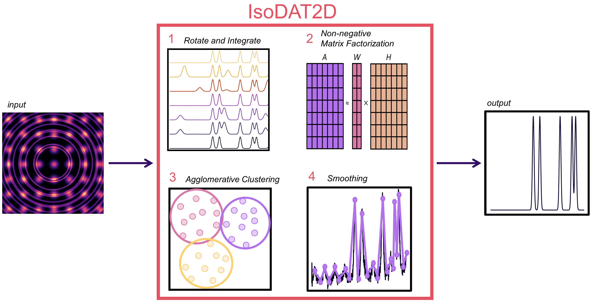

# IsoDAT2D

 A tool for processing thin film total scattering data using non-negative matric factorization and hierarchical agglomerative clustering.

 


## Table of Contents

- [Introduction](#introduction)
- [Features](#features)
- [Getting Started](#getting-started)
- [License](#license)

## Introduction

The IsoDAT2D programcan identify isotropic scattering signals from 2D detector images for thin film X-ray total scattering data processing by using a combination of non-negative matrix factorization and hierarchical agglomerative clustering. Using these unsupervised machine learning algorithms removes the need for the substrate-subtraction data processing method that has limited total scattering analysis to only amorphous substrates.

## Features

- Seperate Isotropic and Anisotropic Scattering

## Getting Started

Instructions on how to clone, and get the project running locally.

```bash
# Clone the repository
git clone https://github.com/dnalverson/IsoDAT2D

# Change into the project directory
cd IsoDAT2D

# Install dependencies
pip install -e .

# Start the project
import IsoDAT2D as id

```
## License

This project is licensed under the [BSD 3-Clause License](https://spdx.org/licenses/BSD-3-Clause-Clear.html) - see the [LICENSE](LICENSE.md) file for details.
